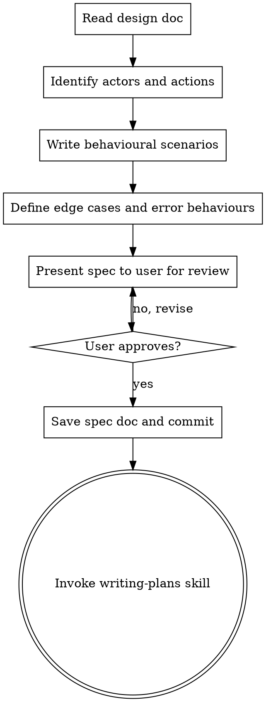

# Writing Behavioural Specs

## Overview

Turn an approved design into concrete, testable behavioural specifications. Behavioural specs define WHAT the system should do from the user's perspective — not HOW it's built. They bridge the gap between a design document (why and what, roughly) and an implementation plan (how, exactly).

**Announce at start:** "I'm using the writing-behavioural-specs skill to define the expected behaviours."

**Context:** Run after brainstorming produces an approved design document. The design doc is your input.

**Save specs to:** `docs/plans/YYYY-MM-DD-<feature-name>-spec.md`

## Why This Step Exists

Designs describe architecture and approach. Implementation plans describe code changes. Neither forces you to precisely define the observable behaviours users will experience. Without a spec:
- Tests get written to match implementation, not intent
- Edge cases surface during coding instead of during thinking
- "Done" is ambiguous — no acceptance criteria to check against

## The Process



**The terminal state is invoking writing-plans.** Do NOT invoke any implementation skill directly.

## Checklist

You MUST create a task for each of these items and complete them in order:

1. **Read the design doc** — load the design document produced by brainstorming
2. **Identify actors and actions** — who interacts with this system and what do they do?
3. **Write behavioural scenarios** — Given/When/Then for each key behaviour
4. **Define edge cases and error behaviours** — what happens when things go wrong?
5. **Present spec for review** — walk through scenarios with user, revise until approved
6. **Save spec doc** — write to `docs/plans/YYYY-MM-DD-<feature-name>-spec.md` and commit
7. **Transition to implementation planning** — invoke writing-plans skill

## Scenario Format

Use Given/When/Then to make each behaviour concrete and testable:

```markdown
### Scenario: [Short descriptive name]

**Given** [precondition — system state before the action]
**When** [action — what the actor does]
**Then** [outcome — observable result]
```

For scenarios with multiple outcomes or variations, use a table:

```markdown
### Scenario: [Name]

**Given** [precondition]

| When | Then |
|------|------|
| [action A] | [outcome A] |
| [action B] | [outcome B] |
| [invalid action] | [error outcome] |
```

## Spec Document Structure

```markdown
# [Feature Name] Behavioural Spec

**Design doc:** `docs/plans/YYYY-MM-DD-<topic>-design.md`

## Actors
- [Actor 1]: [brief description of role]
- [Actor 2]: [brief description of role]

## Behaviours

### [Behaviour Group 1]

#### Scenario: [name]
**Given** ...
**When** ...
**Then** ...

### [Behaviour Group 2]
...

## Edge Cases and Errors

### Scenario: [error case name]
**Given** ...
**When** ...
**Then** [specific error behaviour — message, recovery, state]

## Out of Scope
- [Behaviour explicitly NOT included in this iteration]
```

## Principles

- **Observable behaviours only** — describe what a user or caller sees, not internal implementation details
- **One scenario per behaviour** — don't combine multiple behaviours into one scenario
- **Precise error behaviours** — "shows an error" is not a spec; "returns 404 with message 'Project not found'" is
- **Out of scope is a feature** — explicitly listing what you're NOT building prevents scope creep
- **YAGNI applies here too** — only spec behaviours the design calls for, not hypothetical future needs

## Common Mistakes

### Specifying implementation instead of behaviour
- **Wrong:** "Given the database has a users table with an index on email..."
- **Right:** "Given a registered user with email alice@example.com..."

### Vague outcomes
- **Wrong:** "Then the system handles the error gracefully"
- **Right:** "Then the API returns 400 with body `{\"error\": \"email already registered\"}`"

### Missing the unhappy path
- If you only have happy-path scenarios, you haven't finished. Every behaviour group should have at least one error/edge scenario.

## After the Spec

**Documentation:**
- Write the spec to `docs/plans/YYYY-MM-DD-<feature-name>-spec.md`
- Commit the spec document to git

**Implementation planning:**
- Invoke the writing-plans skill to create a detailed implementation plan
- The plan will use these scenarios as acceptance criteria for each task
- Do NOT invoke any other skill. writing-plans is the next step.

## Integration

**Called by:**
- **superpowers:brainstorming** — after design is approved

**Calls:**
- **superpowers:writing-plans** — to create implementation plan from the spec
