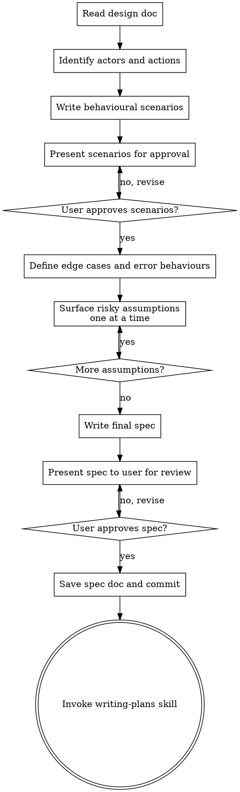

# Writing Behavioural Specs

## Overview

Turn an approved design into a complete, agent-ready behavioural specification. The goal: an autonomous agent should be able to implement from this spec without asking a human for clarification.

Behavioural specs define WHAT the system should do from the user's perspective — not HOW it's built. They bridge the gap between a design document (why and what, roughly) and an implementation plan (how, exactly). A complete spec includes behavioural scenarios, edge cases, integration boundaries, and explicit statements about what the system should NOT do.

**Announce at start:** "I'm using the writing-behavioural-specs skill to define the expected behaviours."

**Context:** Run after brainstorming produces an approved design document. The design doc is your input.

**Save specs to:** `docs/plans/YYYY-MM-DD-<feature-name>-spec.md`

## Why This Step Exists

Designs describe architecture and approach. Implementation plans describe code changes. Neither forces you to precisely define the observable behaviours users will experience. Without a spec:
- Tests get written to match implementation, not intent
- Edge cases surface during coding instead of during thinking
- "Done" is ambiguous — no acceptance criteria to check against

## The Process



**The terminal state is invoking writing-plans.** Do NOT invoke any implementation skill directly.

## Checklist

You MUST create a task for each of these items and complete them in order:

1. **Read the design doc** — load the design document produced by brainstorming
2. **Identify actors and actions** — who interacts with this system and what do they do?
3. **Write behavioural scenarios** — Given/When/Then for each key behaviour
4. **Get user approval on scenarios** — present scenarios, revise until approved. This validates the foundation before building edge cases on top of it
5. **Define edge cases and error behaviours** — what happens when things go wrong? Identify assumptions you're making about correct behaviour
6. **Surface risky assumptions** — present the most uncertain assumptions and their related edge cases to the user, one at a time (see below)
7. **Write final spec** — compile approved scenarios, resolved edge cases, and confirmed behaviours into the spec document. Include Integration Boundaries and What This System Does NOT Do sections. Verify scope has not grown beyond the design doc
8. **Present final spec for review** — walk through the complete spec with user. Confirm: could an agent implement this without asking clarifying questions? Revise until approved
9. **Save spec doc** — write to `docs/plans/YYYY-MM-DD-<feature-name>-spec.md` and commit
10. **Transition to implementation planning** — invoke writing-plans skill

## Scenario Format

Use Given/When/Then to make each behaviour concrete and testable:

```markdown
### Scenario: [Short descriptive name]

**Given** [precondition — system state before the action]
**When** [action — what the actor does]
**Then** [outcome — observable result]
```

For scenarios with multiple outcomes or variations, use a table:

```markdown
### Scenario: [Name]

**Given** [precondition]

| When | Then |
|------|------|
| [action A] | [outcome A] |
| [action B] | [outcome B] |
| [invalid action] | [error outcome] |
```

## Surfacing Risky Assumptions

After defining edge cases, identify assumptions where your "common sense" default might be wrong. These are cases where domain knowledge, business rules, or user expectations could differ from what seems obvious.

**One at a time.** Present each risky assumption as a single question. Do not batch them. Wait for the user's answer before moving to the next one. It prevents overwhelming the user and lets each answer inform how you frame the next question.

**What makes an assumption risky:**
- The correct behaviour depends on business context you don't have (e.g., "should expired tokens return 401 or silently refresh?")
- Two reasonable behaviours exist and picking wrong would be costly to change later
- The edge case involves user-facing messaging or policy decisions
- You're guessing at error recovery strategy (retry? fail? degrade?)

**How to present each assumption:**
1. State the edge case or scenario concretely
2. Explain what you assumed and why
3. Ask what should actually happen — solicit the answer, don't just confirm your guess. Use the `AskUserQuestion` tool.

**Example:**

> **Edge case:** A user submits a form while their session is expiring.
>
> I assumed we should reject the submission and redirect to login, but it's also reasonable to extend the session and accept the submission.
>
> **What should happen here?**

**When to stop:** Once you've surfaced all assumptions where you're genuinely uncertain. Skip obvious cases (e.g., "should invalid JSON return a 400?" — yes, obviously). The goal is to catch the assumptions where being wrong would produce a spec that technically works but does the wrong thing.

## Agent-Readiness Check

Before writing the final spec, verify it passes these checks. A spec that fails any of these will cause an implementing agent to guess, stall, or build the wrong thing.

| Check | Question |
|-------|----------|
| **No ambiguous behaviours** | For every scenario, is the expected outcome a single concrete result — not "appropriate error" or "handles gracefully"? |
| **Edge cases resolved** | Has every risky assumption been confirmed with the user? No "TBD" or "to be decided" items remain? |
| **Integration boundaries stated** | For every external system this feature touches, does the spec say what crosses the boundary and who owns what? |
| **NOT-do statements present** | Are there explicit statements about behaviours the system must NOT exhibit — things a well-meaning implementer might add? |
| **Scope matches design** | Does the spec introduce any behaviours not called for in the approved design doc? If so, remove them or get design amended first |
| **Self-contained** | Could someone read only this spec and the design doc and implement correctly, without asking the author questions? |

## Spec Document Structure

```markdown
# [Feature Name] Behavioural Spec

**Design doc:** `docs/plans/YYYY-MM-DD-<topic>-design.md`

## Actors
- [Actor 1]: [brief description of role]
- [Actor 2]: [brief description of role]

## Behaviours

### [Behaviour Group 1]

#### Scenario: [name]
**Given** ...
**When** ...
**Then** ...

### [Behaviour Group 2]
...

## Edge Cases and Errors

### Scenario: [error case name]
**Given** ...
**When** ...
**Then** [specific error behaviour — message, recovery, state]

## Integration Boundaries
- [External system/API]: [what this feature sends/receives, and where responsibility ends]
- [Shared module]: [what this feature uses, and what it must NOT modify]

## What This System Does NOT Do
- [Explicit non-behaviour — something an implementer might assume is included but is not]
- [Behaviour that belongs to an adjacent system, not this one]

## Out of Scope
- [Behaviour explicitly deferred to a future iteration]
```

## Principles

- **Observable behaviours only** — describe what a user or caller sees, not internal implementation details
- **One scenario per behaviour** — don't combine multiple behaviours into one scenario
- **Precise error behaviours** — "shows an error" is not a spec; "returns 404 with message 'Project not found'" is
- **Scope must match the design** — the spec defines behaviours for the approved design, nothing more. If a scenario would require features not in the design, it belongs in Out of Scope
- **Explicit NOT-do statements** — state what the system does NOT do. An implementer who only reads what to build will invent behaviours to fill gaps. "Does NOT retry failed webhooks" prevents an agent from helpfully adding retry logic
- **Integration boundaries are part of the spec** — where this system touches other systems, state what crosses the boundary and where responsibility ends. An agent can't implement correctly without knowing what it owns vs. what it calls
- **Out of scope is a feature** — explicitly listing what you're NOT building prevents scope creep
- **YAGNI applies here too** — only spec behaviours the design calls for, not hypothetical future needs

## Common Mistakes

### Specifying implementation instead of behaviour
- **Wrong:** "Given the database has a users table with an index on email..."
- **Right:** "Given a registered user with email alice@example.com..."

### Vague outcomes
- **Wrong:** "Then the system handles the error gracefully"
- **Right:** "Then the API returns 400 with body `{\"error\": \"email already registered\"}`"

### Missing the unhappy path
- If you only have happy-path scenarios, you haven't finished. Every behaviour group should have at least one error/edge scenario.

## After the Spec

**Documentation:**
- Write the spec to `docs/plans/YYYY-MM-DD-<feature-name>-spec.md`
- Commit the spec document to git

**Implementation planning:**
- Invoke the writing-plans skill to create a detailed implementation plan
- The plan will use these scenarios as acceptance criteria for each task
- Do NOT invoke any other skill. writing-plans is the next step.

## Integration

**Called by:**
- **superpowers:brainstorming** — after design is approved

**Calls:**
- **superpowers:writing-plans** — to create implementation plan from the spec
